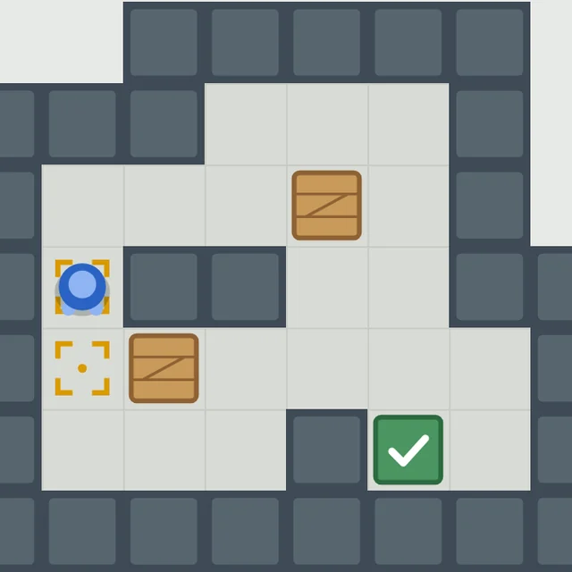
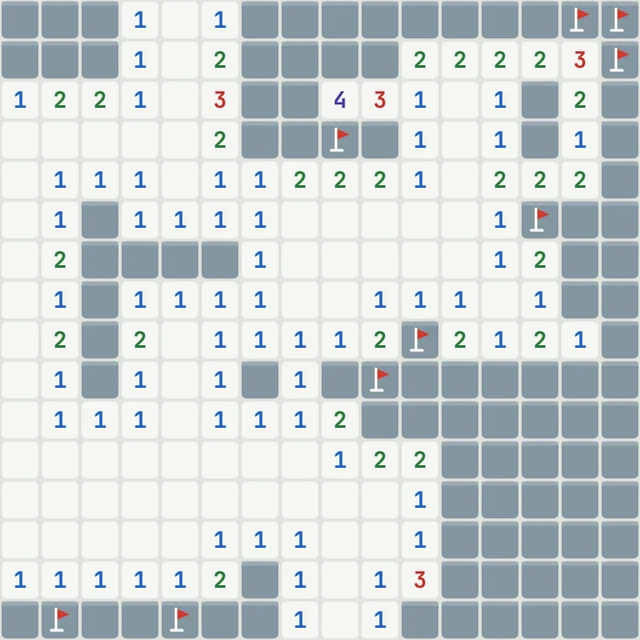

# Игротека

[English version](README.md)

Четыре небольшие игры для браузера. Каждая умещается в один файл, работает на телефоне и на компьютере и говорит по-русски и по-английски.

**[Все игры на одной странице](https://posoxai.github.io/posoxAI/)**

<table>
<tr>
<td width="220" valign="top">
<a href="https://posoxai.github.io/PanelHouseBuildGame/">
<picture>
<source media="(prefers-color-scheme: dark)" srcset="shots/panelka-night.webp">

</picture>
</a>
</td>
<td valign="top">

### Панелька

Кран подвозит этажи панельного дома, а вы ставите их одним нажатием. Всё, что свисает, срезается: чем ровнее, тем выше дом.

[Играть](https://posoxai.github.io/PanelHouseBuildGame/) · [Код](https://github.com/posoxAI/PanelHouseBuildGame)

</td>
</tr>
<tr>
<td width="220" valign="top">
<a href="https://posoxai.github.io/FiveInLineGame/">
<picture>
<source media="(prefers-color-scheme: dark)" srcset="shots/lines-night.webp">

</picture>
</a>
</td>
<td valign="top">

### Пять в линию

Двигайте шарики по полю 9 × 9 и собирайте пять одного цвета в ряд, пока поле не заполнилось. Правила Color Lines 1992 года.

[Играть](https://posoxai.github.io/FiveInLineGame/) · [Код](https://github.com/posoxAI/FiveInLineGame)

</td>
</tr>
<tr>
<td width="220" valign="top">
<a href="https://posoxai.github.io/StorekeeperGame/">
<picture>
<source media="(prefers-color-scheme: dark)" srcset="shots/sklad-night.webp">

</picture>
</a>
</td>
<td valign="top">

### Кладовщик

Двенадцать уровней по правилам сокобана: задвиньте ящики на отмеченные места. Для каждого уровня посчитан минимум толчков, а подсказка покажет следующий ход.

[Играть](https://posoxai.github.io/StorekeeperGame/) · [Код](https://github.com/posoxAI/StorekeeperGame)

</td>
</tr>
<tr>
<td width="220" valign="top">
<a href="https://posoxai.github.io/MinesweeperGame/">
<picture>
<source media="(prefers-color-scheme: dark)" srcset="shots/saper-night.webp">

</picture>
</a>
</td>
<td valign="top">

### Сапёр

Три классических поля, флажки, таймер и рекорды. Первый ход всегда безопасен.

[Играть](https://posoxai.github.io/MinesweeperGame/) · [Код](https://github.com/posoxAI/MinesweeperGame)

</td>
</tr>
</table>

## Счётчик посещений

Опубликованная страница считает посещения через [GoatCounter](https://www.goatcounter.com/). По словам сервиса, он не ставит cookies и не хранит личных данных. Когда `index.html` открыт с диска, счётчик не работает.

## О проекте

Игры написал Claude, ИИ-ассистент компании Anthropic. Идеи и правки принадлежат posoxAI. Код открыт под лицензией MIT.

Каждая игра открывается на русском, если он есть в списке языков браузера, иначе на английском. В каждой есть переключатель RU/EN.

В этом репозитории лежат общая страница (`index.html`), картинки к ней (`shots/`) и файл `README.md`, который GitHub показывает в профиле.
